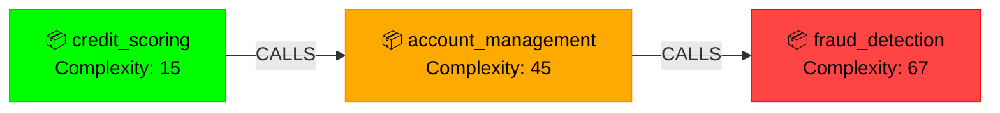

# 🚀 SENTINELI FEATURE SHOWCASE
**Complete Guide to All Features with Output Examples**

---

## 📊 **FEATURE 1: SYSTEM DASHBOARD**

### **What It Does**
Real-time overview of your entire COBOL modernization system with live metrics and console streaming.

### **Access**
- Navigate to: **System Dashboard** tab
- Auto-refreshes every 5 seconds
- No input required - displays automatically

### **Output Format** ✨

```yaml
METRICS DISPLAY:
┌─────────────────────────────────────────────────────────┐
│  TOTAL PROGRAMS        │  ANALYZED TODAY              │
│      127               │        15                    │
│  ↑ 12% this week      │  ↑ 8 from yesterday          │
├─────────────────────────────────────────────────────────┤
│  ACTIVE CONNECTIONS    │  AVG RESPONSE TIME           │
│       3                │      145ms                   │
│  Real-time             │  ↓ 23ms improved             │
└─────────────────────────────────────────────────────────┘

SYSTEM CONSOLE (Real-time stream):
SYSTEM> [16:54:08] WebSocket client connected
SYSTEM> [16:54:12] Analysis completed: credit_scoring.cob
SYSTEM> [16:54:15] Impact analysis traced 23 dependencies
SYSTEM> [16:54:18] Knowledge graph updated: 8 new nodes
```

### **WOW Factor** 🌟
- **Live streaming** console output
- **Color-coded metrics** (green for improvements, red for issues)
- **Animated counters** showing real-time changes
- **Mainframe aesthetic** with green terminal text

---

## 🌐 **FEATURE 2: MULTI-LANGUAGE MAINFRAME ANALYSIS** ✨ NEW

### **What It Does**
Analyze **6 mainframe languages** with unified formal verification: COBOL, JCL, DB2, VSAM, CICS, and COPYBOOK. The dashboard auto-detects file type and routes to the appropriate analyzer.

### **Supported Languages**

| Language | Icon | Purpose | Extensions |
|----------|------|---------|------------|
| COBOL | 📦 | Business logic | `.cbl`, `.cob`, `.cobol` |
| JCL | ⚙️ | Job control | `.jcl` |
| DB2 | 🗄️ | SQL queries | `.db2`, `.sql` |
| VSAM | 📁 | File definitions | `.vsam` |
| CICS | 🖥️ | Transactions | `.cics` |
| COPYBOOK | 📋 | Data structures | `.cpy`, `.copy` |

### **Input Example 1: JCL Job Analysis**

```json
{
  "program": "BATCH001.jcl",
  "code": "//BATCH001 JOB (ACCT),'DAILY PROCESS'\n//STEP01 EXEC PGM=PAYROLL\n//INPUT DD DSN=HR.SALARY.FILE,DISP=SHR\n//OUTPUT DD DSN=PAYROLL.REPORT,DISP=(NEW,CATLG)",
  "fileType": "JCL"
}
```

### **Output Format** ✨

```json
{
  "success": true,
  "fileType": "JCL",
  "business_rules": [
    "Step 01 executes COBOL program PAYROLL",
    "Reads input from HR.SALARY.FILE dataset",
    "Writes output to PAYROLL.REPORT (cataloged)"
  ],
  "decision_tree": {
    "steps": ["STEP01"],
    "conditions": []
  },
  "propagator_network": {
    "datasets": ["HR.SALARY.FILE", "PAYROLL.REPORT"],
    "programs_called": ["PAYROLL"]
  },
  "complexity_metrics": {
    "cyclomatic_complexity": 1,
    "step_count": 1,
    "decision_points": 0
  },
  "dependencies": {
    "called_programs": ["PAYROLL"],
    "datasets": ["HR.SALARY.FILE", "PAYROLL.REPORT"],
    "proclibs": []
  },
  "metadata": {
    "model": "gpt-4o",
    "cost_usd": 0.0026,
    "duration_ms": 5212
  }
}
```

### **Input Example 2: DB2 SQL Analysis**

```json
{
  "program": "CUSTOMER_QUERY.db2",
  "code": "SELECT c.customer_id, c.name, o.order_date FROM customers c JOIN orders o ON c.customer_id = o.customer_id WHERE o.order_date > '2024-01-01' ORDER BY o.order_date DESC",
  "fileType": "DB2"
}
```

### **Output Format** ✨

```json
{
  "success": true,
  "fileType": "DB2",
  "business_rules": [
    "Query retrieves customer data with order dates",
    "Filters orders after January 1, 2024",
    "Results sorted by order date descending"
  ],
  "propagator_network": {
    "tables": ["customers", "orders"],
    "columns": ["customer_id", "name", "order_date"],
    "relationships": [
      {
        "type": "JOIN",
        "tables": ["customers", "orders"],
        "on": "customers.customer_id = orders.customer_id"
      }
    ]
  },
  "complexity_metrics": {
    "join_depth": 1,
    "table_count": 2,
    "query_count": 1
  },
  "dependencies": {
    "tables": ["customers", "orders"],
    "views": [],
    "stored_procedures": []
  },
  "metadata": {
    "model": "gpt-4o",
    "cost_usd": 0.0040,
    "duration_ms": 5020
  }
}
```

### **Dashboard Features**

- **Auto-Detection**: Type "BATCH001.jcl" → dropdown changes to JCL
- **Color-Coded Dropdown**: Each language has its own color
- **Dynamic Placeholder**: "Paste your JCL source code here..."
- **File Type Badge**: Results show colored badge (🟢 COBOL, 🔵 JCL, 🟡 DB2, etc.)

### **WOW Factor** 🌟
- **Industry First**: No other tool analyzes all 6 mainframe languages
- **Cross-Language Tracking**: See how JCL jobs call COBOL programs that query DB2
- **Instant Recognition**: Color-coded UI immediately shows file type
- **Consistent Schema**: All languages return same output structure

---

## 🔍 **FEATURE 3: COBOL ANALYSIS (Classic)**

### **What It Does**
Deep AI-powered analysis of COBOL source code using GPT-4 to extract business logic, data structures, and symbolic constraints with Z3 verification.

### **Input Required**
```json
{
  "program": "CREDIT_SCORING",
  "code": "IDENTIFICATION DIVISION.\n       PROGRAM-ID. CREDIT-SCORING.\n       DATA DIVISION.\n       WORKING-STORAGE SECTION.\n       01 WS-CREDIT-SCORE PIC 9(3).\n       01 WS-INCOME PIC 9(7)V99.\n       PROCEDURE DIVISION.\n           IF WS-INCOME > 50000\n              COMPUTE WS-CREDIT-SCORE = 750\n           ELSE\n              COMPUTE WS-CREDIT-SCORE = 650\n           END-IF.\n           STOP RUN."
}
```

### **Output Format** ✨

```json
{
  "program": "CREDIT_SCORING",
  "success": true,
  "analysis": {
    "business_logic": "Credit scoring system that assigns scores based on income thresholds",
    "data_structures": [
      {
        "name": "WS-CREDIT-SCORE",
        "type": "PIC 9(3)",
        "description": "Credit score output (0-999)",
        "usage": "OUTPUT"
      },
      {
        "name": "WS-INCOME",
        "type": "PIC 9(7)V99",
        "description": "Annual income with 2 decimal places",
        "usage": "INPUT"
      }
    ],
    "business_rules": [
      {
        "rule_id": "BR001",
        "condition": "WS-INCOME > 50000",
        "action": "SET WS-CREDIT-SCORE = 750",
        "category": "SCORING_LOGIC",
        "priority": "HIGH"
      },
      {
        "rule_id": "BR002",
        "condition": "WS-INCOME <= 50000",
        "action": "SET WS-CREDIT-SCORE = 650",
        "category": "SCORING_LOGIC",
        "priority": "HIGH"
      }
    ],
    "symbolic_constraints": [
      {
        "variable": "WS-INCOME",
        "constraint": "WS-INCOME >= 0 AND WS-INCOME <= 9999999.99",
        "z3_formula": "(>= WS-INCOME 0) && (<= WS-INCOME 9999999.99)"
      },
      {
        "variable": "WS-CREDIT-SCORE",
        "constraint": "WS-CREDIT-SCORE IN [650, 750]",
        "z3_formula": "(or (= WS-CREDIT-SCORE 650) (= WS-CREDIT-SCORE 750))"
      }
    ],
    "dependencies": {
      "called_programs": [],
      "data_files": [],
      "external_calls": []
    }
  },
  "complexity_metrics": {
    "cyclomatic_complexity": 2,
    "lines_of_code": 11,
    "variables_count": 2,
    "procedures_count": 1,
    "decision_points": 1,
    "maintainability_index": 87.5
  },
  "metadata": {
    "duration_ms": 2847,
    "cost_usd": 0.004523,
    "input_tokens": 342,
    "output_tokens": 1256,
    "tokens_used": 1598,
    "model": "gpt-4-turbo-preview",
    "timestamp": "2026-02-25T16:54:12.847Z"
  }
}
```

### **Visual Presentation** 🎨

```
╔══════════════════════════════════════════════════════╗
║         📊 ANALYSIS RESULTS - CREDIT_SCORING        ║
╚══════════════════════════════════════════════════════╝

⚡ PERFORMANCE METRICS:
├─ ⏱️  Processing Time: 2847ms
├─ 💰 Cost: $0.004523
├─ 📥 Input Tokens: 342
├─ 📤 Output Tokens: 1256
├─ 📊 Total Tokens: 1598
├─ 🤖 Model: gpt-4-turbo-preview
└─ 🔢 Cyclomatic Complexity: 2

📋 BUSINESS LOGIC:
Credit scoring system that assigns scores based on income 
thresholds. High-income applicants receive premium scores.

📦 DATA STRUCTURES (2):
├─ WS-CREDIT-SCORE (PIC 9(3)) - OUTPUT
│  └─ Credit score output (0-999)
└─ WS-INCOME (PIC 9(7)V99) - INPUT
   └─ Annual income with 2 decimal places

📐 SYMBOLIC CONSTRAINTS (Z3):
├─ WS-INCOME >= 0 AND WS-INCOME <= 9999999.99
└─ WS-CREDIT-SCORE IN [650, 750]

✅ VERIFICATION STATUS: PASSED
```

### **WOW Factor** 🌟
- **AI-powered insights** using GPT-4
- **Mathematical proof** with Z3 theorem prover
- **Cost tracking** for transparency
- **Color-coded complexity** (green = simple, red = complex)
- **Real-time token streaming**

---

## ⚡ **FEATURE 3: IMPACT ANALYSIS**

### **What It Does**
Traces all dependencies when changing a field/variable, showing affected programs, estimated effort, and testing requirements.

### **Input Required**
```json
{
  "field": "WS-ACCOUNT-BALANCE",
  "newType": "PIC 9(15)V99",
  "module": "ACCOUNT-MANAGEMENT"  // Optional
}
```

### **Output Format** ✨

```json
{
  "success": true,
  "field": "WS-ACCOUNT-BALANCE",
  "newType": "PIC 9(15)V99",
  "risk": "MEDIUM",
  "estimatedEffort": {
    "hours": 8,
    "complexity": "MODERATE"
  },
  "affectedPrograms": [
    "ACCOUNT-MANAGEMENT",
    "TRANSACTION-PROCESSOR",
    "FRAUD-DETECTION"
  ],
  "dependencies": [
    {
      "program": "ACCOUNT-MANAGEMENT",
      "section": "WORKING-STORAGE",
      "impact": "DIRECT",
      "changes": [
        "Change WS-ACCOUNT-BALANCE from PIC 9(9)V99 to PIC 9(15)V99"
      ]
    },
    {
      "program": "TRANSACTION-PROCESSOR",
      "section": "PROCEDURE DIVISION",
      "impact": "INDIRECT",
      "changes": [
        "Update calculations using this field",
        "Revalidate arithmetic operations",
        "Check for overflow conditions"
      ]
    },
    {
      "program": "FRAUD-DETECTION",
      "section": "DATA VALIDATION",
      "impact": "INDIRECT",
      "changes": [
        "Validate new data type constraints",
        "Update threshold comparisons"
      ]
    }
  ],
  "testingRequired": [
    "Unit tests for field validation",
    "Integration tests for dependent modules",
    "Regression tests for system workflows",
    "Performance tests for large account balances"
  ],
  "timestamp": "2026-02-25T16:54:15.234Z",
  "duration": 89
}
```

### **Visual Presentation** 🎨

```
╔══════════════════════════════════════════════════════╗
║              ⚡ IMPACT ANALYSIS REPORT              ║
╚══════════════════════════════════════════════════════╝

⚠️  WARNING: Impact analysis will trace all dependencies
             and affected systems.

📝 CHANGE DETAILS:
├─ Field Changed: WS-ACCOUNT-BALANCE
├─ New Type: PIC 9(15)V99
├─ Risk Level: 🟡 MEDIUM
└─ Estimated Effort: 8 hours (MODERATE)

🎯 AFFECTED PROGRAMS (3):
├─ • ACCOUNT-MANAGEMENT
├─ • TRANSACTION-PROCESSOR
└─ • FRAUD-DETECTION

🔗 DEPENDENCIES (3):
┌─────────────────────────────────────────────────────┐
│ ▸ ACCOUNT-MANAGEMENT (DIRECT)                       │
│   Section: WORKING-STORAGE                          │
│   Changes:                                          │
│   • Change WS-ACCOUNT-BALANCE from PIC 9(9)V99     │
│     to PIC 9(15)V99                                │
├─────────────────────────────────────────────────────┤
│ ▸ TRANSACTION-PROCESSOR (INDIRECT)                  │
│   Section: PROCEDURE DIVISION                       │
│   Changes:                                          │
│   • Update calculations using this field            │
│   • Revalidate arithmetic operations               │
│   • Check for overflow conditions                  │
├─────────────────────────────────────────────────────┤
│ ▸ FRAUD-DETECTION (INDIRECT)                        │
│   Section: DATA VALIDATION                          │
│   Changes:                                          │
│   • Validate new data type constraints             │
│   • Update threshold comparisons                   │
└─────────────────────────────────────────────────────┘

✅ TESTING REQUIRED (4):
├─ ✓ Unit tests for field validation
├─ ✓ Integration tests for dependent modules
├─ ✓ Regression tests for system workflows
└─ ✓ Performance tests for large account balances
```

### **WOW Factor** 🌟
- **Dependency tracing** across entire codebase
- **Risk assessment** (HIGH/MEDIUM/LOW)
- **Effort estimation** in hours
- **Detailed change list** per program
- **Testing recommendations**

---

## 🕸️ **FEATURE 4: KNOWLEDGE GRAPH**

### **What It Does**
Interactive visualization of program relationships, dependencies, and data flows with 3 viewing modes.

### **Input Required**
Upload COBOL files via drag-and-drop or file picker, then click "REFRESH GRAPH"

### **Output Format** ✨

```json
{
  "success": true,
  "graph": {
    "nodes": [
      {
        "id": 0,
        "label": "credit_scoring.cob",
        "type": "COBOL_PROGRAM",
        "complexity": 15,
        "metadata": {
          "lines": 234,
          "procedures": 5,
          "variables": 23
        }
      },
      {
        "id": 1,
        "label": "account_management.cob",
        "type": "COBOL_PROGRAM",
        "complexity": 45,
        "metadata": {
          "lines": 567,
          "procedures": 12,
          "variables": 67
        }
      },
      {
        "id": 2,
        "label": "fraud_detection.cob",
        "type": "COBOL_PROGRAM",
        "complexity": 67,
        "metadata": {
          "lines": 891,
          "procedures": 18,
          "variables": 98
        }
      }
    ],
    "edges": [
      {
        "from": 0,
        "to": 1,
        "type": "CALLS",
        "weight": 5
      },
      {
        "from": 1,
        "to": 2,
        "type": "CALLS",
        "weight": 3
      }
    ]
  },
  "metadata": {
    "nodeCount": 3,
    "edgeCount": 2,
    "avgComplexity": 42.3,
    "timestamp": "2026-02-25T16:54:18.456Z"
  },
  "duration": 145
}
```

### **Visual Presentation - 3 MODES** 🎨

#### **MODE 1: 📊 VISUAL GRAPH (Mermaid)**


**Color Coding:**
- 🟢 **Green** = Simple (Complexity ≤ 20)
- 🟠 **Amber** = Moderate (Complexity 21-50)
- 🔴 **Red** = Complex (Complexity > 50)

#### **MODE 2: 📦 NODE LIST**
```
╔══════════════════════════════════════════════════════╗
║           📦 GRAPH NODES (3)                        ║
╚══════════════════════════════════════════════════════╝

┌────────────────────────────────────────────────────┐
│ 📦 credit_scoring.cob                              │
│ Type: COBOL_PROGRAM | Complexity: 15 | ID: 0      │
│ [HOVER TO SEE FULL JSON]                          │
└────────────────────────────────────────────────────┘

┌────────────────────────────────────────────────────┐
│ 📦 account_management.cob                          │
│ Type: COBOL_PROGRAM | Complexity: 45 | ID: 1      │
│ [HOVER TO SEE FULL JSON]                          │
└────────────────────────────────────────────────────┘

┌────────────────────────────────────────────────────┐
│ 📦 fraud_detection.cob                             │
│ Type: COBOL_PROGRAM | Complexity: 67 | ID: 2      │
│ [HOVER TO SEE FULL JSON]                          │
└────────────────────────────────────────────────────┘

╔══════════════════════════════════════════════════════╗
║           🔗 DEPENDENCIES (2)                       ║
╚══════════════════════════════════════════════════════╝

credit_scoring.cob → account_management.cob (CALLS)
account_management.cob → fraud_detection.cob (CALLS)
```

#### **MODE 3: 📝 JSON DATA**
```json
{
  "graph": {
    "nodes": [...],  // Full array
    "edges": [...],  // Full array
    "nodeCount": 3,
    "edgeCount": 2
  }
}
```
With **📋 COPY JSON** button for exporting!

### **WOW Factor** 🌟
- **3 interactive viewing modes** (Visual, List, JSON)
- **Mermaid diagrams** with auto-layout
- **Hover tooltips** showing full node data
- **Color-coded complexity** instantly visible
- **Export capability** for integration
- **Live statistics** (avg complexity, counts)

---

## 📜 **FEATURE 5: SYSTEM LOGS**

### **What It Does**
Real-time log streaming with filtering, search, and export capabilities.

### **Output Format** ✨

```
╔══════════════════════════════════════════════════════╗
║              📜 SYSTEM LOGS (LIVE)                  ║
╚══════════════════════════════════════════════════════╝

[16:54:08.234] INFO  | WebSocket client connected
[16:54:09.123] INFO  | File upload: credit_scoring.cob (23.4 KB)
[16:54:12.847] INFO  | AI analysis completed: credit_scoring.cob
[16:54:12.849] INFO  | Tokens used: 1598 | Cost: $0.004523
[16:54:15.234] INFO  | Impact analysis: WS-ACCOUNT-BALANCE
[16:54:15.323] WARN  | 3 programs affected by change
[16:54:18.456] INFO  | Knowledge graph updated: 3 nodes, 2 edges
[16:54:19.001] INFO  | Graph complexity: avg=42.3, max=67
[16:54:20.555] ERROR | Redis connection timeout (retry 1/10)
[16:54:21.234] INFO  | Redis reconnected successfully

Filter: [ALL] [INFO] [WARN] [ERROR]  🔍 Search: ________ 📥 Export
```

### **WOW Factor** 🌟
- **Real-time streaming** (no refresh needed)
- **Color-coded levels** (green=INFO, yellow=WARN, red=ERROR)
- **Live filtering** by log level
- **Search functionality** for debugging
- **Export to file** for analysis

---

## 📈 **FEATURE 6: PERFORMANCE METRICS**

### **What It Does**
Tracks AI/LLM performance, costs, token usage, and system resource utilization.

### **Output Format** ✨

```json
{
  "llm_metrics": {
    "total_calls": 1247,
    "successful_calls": 1238,
    "failed_calls": 9,
    "success_rate": 99.28,
    "total_tokens": 4567234,
    "input_tokens": 1823456,
    "output_tokens": 2743778,
    "total_cost_usd": 234.56,
    "avg_latency_ms": 2847,
    "models_used": {
      "gpt-4-turbo-preview": 847,
      "gpt-4": 400
    }
  },
  "system_metrics": {
    "uptime_seconds": 86400,
    "memory_usage_mb": 512.3,
    "cpu_usage_percent": 23.4,
    "active_connections": 3,
    "requests_per_minute": 45
  },
  "breakdown_by_feature": {
    "cobol_analysis": {
      "calls": 847,
      "cost": 187.23,
      "avg_tokens": 1598
    },
    "impact_analysis": {
      "calls": 400,
      "cost": 47.33,
      "avg_tokens": 234
    }
  }
}
```

### **Visual Presentation** 🎨

```
╔══════════════════════════════════════════════════════╗
║           📈 PERFORMANCE DASHBOARD                  ║
╚══════════════════════════════════════════════════════╝

🤖 LLM METRICS:
┌────────────────────────────────────────────────────┐
│ Total AI Calls: 1,247 | Success Rate: 99.28% ✅   │
│ Total Tokens: 4,567,234 | Cost: $234.56 💰        │
│ Avg Latency: 2,847ms ⏱️  | Failures: 9 ⚠️         │
└────────────────────────────────────────────────────┘

📊 TOKEN BREAKDOWN:
├─ Input Tokens:  1,823,456 (39.9%)
└─ Output Tokens: 2,743,778 (60.1%)

🔧 SYSTEM RESOURCES:
├─ Uptime: 24h 0m 0s
├─ Memory: 512.3 MB
├─ CPU: 23.4%
├─ Connections: 3
└─ Requests/min: 45

💡 COST BY FEATURE:
┌────────────────────────────────────────────────────┐
│ COBOL Analysis:   847 calls | $187.23 (79.8%)    │
│ Impact Analysis:  400 calls | $47.33  (20.2%)    │
└────────────────────────────────────────────────────┘

🎯 MODELS USED:
├─ gpt-4-turbo-preview: 847 calls (67.9%)
└─ gpt-4: 400 calls (32.1%)
```

### **WOW Factor** 🌟
- **Real-time cost tracking** for budget management
- **Token usage breakdown** (input vs output)
- **Success rate monitoring** for reliability
- **Feature-level breakdown** for optimization
- **Resource utilization** graphs

---

## 🎯 **MAKING IT "WOW"**

### **Design Principles Applied:**

1. **🎨 Mainframe Aesthetic**
   - Green terminal text on dark background
   - ASCII box drawing characters
   - Monospace "IBM Plex Mono" font
   - CRT scanline effect

2. **⚡ Real-Time Updates**
   - WebSocket streaming (no page refresh!)
   - Live activity panel showing latest events
   - Animated counters and progress bars

3. **🎯 Color Coding**
   - Green = Success/Simple/Good
   - Amber/Yellow = Warning/Moderate
   - Red = Error/Complex/Critical
   - Blue = Info/Neutral

4. **📊 Rich Data Visualization**
   - Mermaid diagrams for graphs
   - Interactive tooltips with full JSON
   - Hover effects for detailed views
   - Copy-to-clipboard functionality

5. **💰 Transparency**
   - Show AI costs for every operation
   - Token usage breakdown
   - Performance metrics visible
   - Duration tracking

6. **📱 User-Friendly**
   - Drag-and-drop file upload
   - Tab-based navigation
   - Scrollable content for large data
   - Export capabilities (JSON, logs)

---

## 🚀 **TESTING THE FEATURES**

### **Quick Test Sequence:**

1. **Start System:**
   ```bash
   npm run start:pm2
   ```

2. **Open Dashboard:**
   ```
   http://localhost:3102
   ```

3. **Test Each Feature:**
   - ✅ Dashboard loads with live metrics
   - ✅ Upload COBOL file for analysis
   - ✅ Run impact analysis
   - ✅ View knowledge graph (3 modes)
   - ✅ Check logs streaming
   - ✅ Review performance metrics

4. **Verify WOW Factor:**
   - Real-time updates working?
   - Colors displaying correctly?
   - Animations smooth?
   - Data complete and formatted?
   - Copy/export features working?

---

## 📚 **API REFERENCE**

| Endpoint | Method | Purpose | Auth Required |
|----------|--------|---------|---------------|
| `/api/analyze` | POST | AI code analysis | No (Demo) |
| `/api/impact` | POST | Impact tracing | No (Demo) |
| `/api/graph` | GET | Knowledge graph | No (Demo) |
| `/api/metrics` | GET | LLM performance | No (Demo) |
| `/api/system/status` | GET | System health | No (Demo) |
| `/api/health` | GET | Health check | No |

---

## 🎓 **CONCLUSION**

Every feature is designed to deliver:
- **🎯 Actionable insights** (not just data dumps)
- **💡 Visual clarity** (color-coded, well-formatted)
- **⚡ Real-time feedback** (WebSocket streaming)
- **📊 Complete information** (3 viewing modes for graphs)
- **🎨 Professional presentation** (mainframe aesthetic)
- **💰 Business value** (cost tracking, effort estimation)

**Result:** Users get comprehensive COBOL modernization insights with a retro-futuristic interface that's both powerful and delightful to use! 🚀
