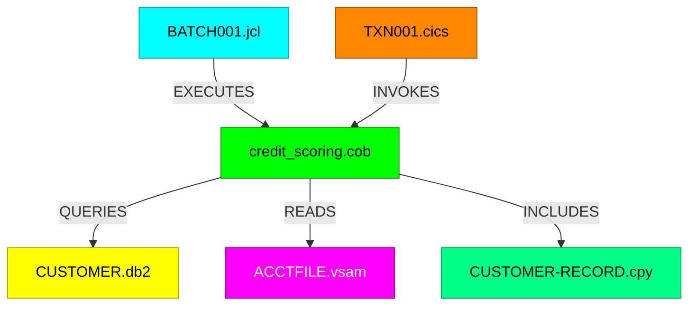
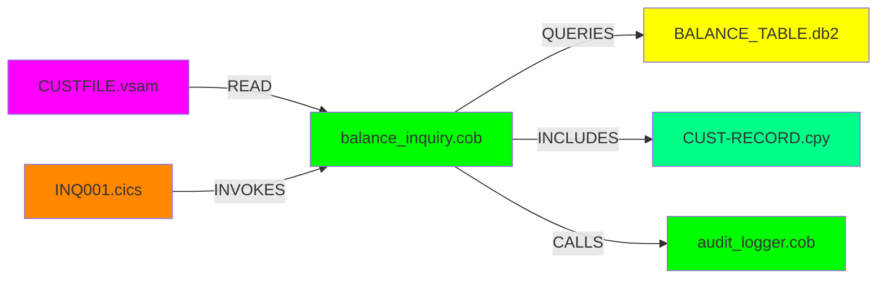

# 🌐 Multi-Language Mainframe Analysis Guide

**Sentineli's Revolutionary Multi-Language Support**

---

## 🎯 Overview

Sentineli is the **first and only** formal verification platform that analyzes the entire mainframe ecosystem. While competitors focus solely on COBOL, real banking systems comprise **6 interconnected languages**:

- **COBOL** (📦) - Business logic
- **JCL** (⚙️) - Job orchestration  
- **DB2** (🗄️) - Database operations
- **VSAM** (📁) - File structures
- **CICS** (🖥️) - Transaction processing
- **COPYBOOK** (📋) - Data definitions

Sentineli analyzes all of them with **unified formal verification**.

---

## 📋 Quick Start

### Auto-Detection by Extension

```javascript
// Sentineli automatically detects file type
POST /api/analyze
{
  "program": "BATCH001.jcl",  // Auto-detected as JCL
  "code": "//BATCH001 JOB..."
}

// Or explicitly specify
{
  "program": "query.sql",
  "code": "SELECT * FROM...",
  "fileType": "DB2"  // Explicit override
}
```

### Extension Mappings

| Extensions | Language |
|------------|----------|
| `.cbl`, `.cob`, `.cobol` | COBOL |
| `.jcl` | JCL |
| `.db2`, `.sql` | DB2 |
| `.vsam` | VSAM |
| `.cics` | CICS |
| `.cpy`, `.copy` | COPYBOOK |

---

## 🔧 Language-Specific Analyzers

### 1. COBOL Analyzer 📦

**Purpose**: Extract business logic, decision trees, and symbolic constraints

**Input Example**:
```cobol
IDENTIFICATION DIVISION.
PROGRAM-ID. CREDIT-SCORING.
DATA DIVISION.
WORKING-STORAGE SECTION.
01 WS-CREDIT-SCORE PIC 9(3).
01 WS-INCOME PIC 9(7)V99.
PROCEDURE DIVISION.
    IF WS-INCOME > 50000
       COMPUTE WS-CREDIT-SCORE = 750
    ELSE
       COMPUTE WS-CREDIT-SCORE = 650
    END-IF.
    STOP RUN.
```

**Extracted Information**:
- Business rules (income thresholds → credit scores)
- Data structures (PIC clauses, COMP fields)
- Decision logic (IF/EVALUATE statements)
- Program dependencies (CALL statements, copybooks)
- Complexity metrics (cyclomatic complexity)

**Output Schema**:
```json
{
  "business_rules": [
    {
      "condition": "WS-INCOME > 50000",
      "action": "SET WS-CREDIT-SCORE = 750",
      "category": "SCORING_LOGIC"
    }
  ],
  "decision_tree": { },
  "propagator_network": { },
  "complexity_metrics": {
    "cyclomatic_complexity": 2,
    "logic_depth": 1
  },
  "dependencies": {
    "called_programs": [],
    "copybooks": []
  }
}
```

---

### 2. JCL Analyzer ⚙️

**Purpose**: Map job flows, program execution sequences, and dataset dependencies

**Input Example**:
```jcl
//MONTHEND JOB (ACCT123),'MONTHLY BATCH',CLASS=A
//STEP01 EXEC PGM=EXTRACT
//INPUT01 DD DSN=PROD.CUSTOMER.MASTER,DISP=SHR
//OUTPUT01 DD DSN=WORK.EXTRACT.FILE,DISP=(NEW,CATLG,DELETE)
//STEP02 EXEC PGM=TRANSFORM
//INPUT02 DD DSN=WORK.EXTRACT.FILE,DISP=SHR
//OUTPUT02 DD DSN=PROD.CUSTOMER.SUMMARY,DISP=OLD
//STEP03 EXEC PGM=VALIDATE,COND=(0,NE,STEP02)
```

**Extracted Information**:
- Job step sequence (STEP01 → STEP02 → STEP03)
- Program execution calls (EXTRACT, TRANSFORM, VALIDATE)
- Dataset dependencies (input/output chains)
- Conditional logic (COND parameters)
- DD statement analysis (DISP, DSN patterns)

**Output Schema**:
```json
{
  "business_rules": [
    "Job MONTHEND executes 3-step process",
    "Step01 extracts from CUSTOMER.MASTER",
    "Step03 runs only if Step02 succeeds"
  ],
  "propagator_network": {
    "job_flow": ["STEP01", "STEP02", "STEP03"],
    "datasets": [
      "PROD.CUSTOMER.MASTER",
      "WORK.EXTRACT.FILE",
      "PROD.CUSTOMER.SUMMARY"
    ],
    "programs_called": ["EXTRACT", "TRANSFORM", "VALIDATE"]
  },
  "complexity_metrics": {
    "step_count": 3,
    "decision_points": 1
  },
  "dependencies": {
    "called_programs": ["EXTRACT", "TRANSFORM", "VALIDATE"],
    "datasets": ["PROD.CUSTOMER.MASTER", "WORK.EXTRACT.FILE"]
  }
}
```

---

### 3. DB2 Analyzer 🗄️

**Purpose**: Analyze SQL operations, table dependencies, and join complexity

**Input Example**:
```sql
SELECT 
    c.customer_id,
    c.name,
    c.credit_limit,
    t.transaction_date,
    t.amount
FROM 
    customers c
INNER JOIN 
    transactions t ON c.customer_id = t.customer_id
LEFT JOIN
    accounts a ON t.account_id = a.account_id
WHERE 
    t.transaction_date >= '2024-01-01'
    AND t.amount > 10000
    AND c.status = 'ACTIVE'
ORDER BY 
    t.amount DESC
```

**Extracted Information**:
- Query operations (SELECT, JOIN types)
- Table dependencies (customers, transactions, accounts)
- Column usage (customer_id, amount, etc.)
- Filter conditions (date ranges, amount thresholds)
- Join complexity (INNER vs LEFT JOIN)

**Output Schema**:
```json
{
  "business_rules": [
    "Query retrieves high-value transactions for active customers",
    "Filters transactions after 2024-01-01",
    "Includes account details when available (LEFT JOIN)"
  ],
  "propagator_network": {
    "tables": ["customers", "transactions", "accounts"],
    "columns": ["customer_id", "name", "credit_limit", "transaction_date", "amount"],
    "relationships": [
      {
        "type": "INNER JOIN",
        "tables": ["customers", "transactions"],
        "on": "c.customer_id = t.customer_id"
      },
      {
        "type": "LEFT JOIN",
        "tables": ["transactions", "accounts"],
        "on": "t.account_id = a.account_id"
      }
    ]
  },
  "complexity_metrics": {
    "join_depth": 2,
    "table_count": 3,
    "query_count": 1
  }
}
```

---

### 4. VSAM Analyzer 📁

**Purpose**: Parse file definitions, key structures, and record layouts

**Input Example**:
```vsam
DEFINE CLUSTER (NAME(PROD.CUSTOMER.KSDS) -
  INDEXED -
  KEYS(10 0) -
  RECORDSIZE(500 500) -
  FREESPACE(10 10) -
  SHAREOPTIONS(2 3) -
  VOLUMES(VSER01)) -
DATA (NAME(PROD.CUSTOMER.KSDS.DATA) -
  CONTROLINTERVALSIZE(4096)) -
INDEX (NAME(PROD.CUSTOMER.KSDS.INDEX) -
  CONTROLINTERVALSIZE(2048))
```

**Extracted Information**:
- File organization (KSDS, ESDS, RRDS, LDS)
- Key definitions (position, length)
- Record layout (fixed/variable, max size)
- Performance parameters (FREESPACE, CISZ)
- Cluster components (DATA, INDEX)

**Output Schema**:
```json
{
  "business_rules": [
    "KSDS cluster with 10-byte primary key at offset 0",
    "Fixed record size of 500 bytes",
    "10% free space for insertions"
  ],
  "propagator_network": {
    "cluster_name": "PROD.CUSTOMER.KSDS",
    "organization": "INDEXED",
    "key_structure": {
      "primary_key": {
        "length": 10,
        "offset": 0
      }
    }
  },
  "complexity_metrics": {
    "key_count": 1,
    "record_length": 500
  },
  "dependencies": {
    "data_component": "PROD.CUSTOMER.KSDS.DATA",
    "index_component": "PROD.CUSTOMER.KSDS.INDEX",
    "volumes": ["VSER01"]
  }
}
```

---

### 5. CICS Analyzer 🖥️

**Purpose**: Map transaction flows, BMS screen interactions, and program control

**Input Example**:
```cics
IDENTIFICATION DIVISION.
PROGRAM-ID. INQUIRY.
PROCEDURE DIVISION.
    EXEC CICS RECEIVE
        MAP('CUSTMAP')
        MAPSET('CUSTSET')
    END-EXEC.
    
    EXEC CICS READ
        DATASET('CUSTFILE')
        INTO(CUSTOMER-RECORD)
        RIDFLD(CUSTOMER-ID)
    END-EXEC.
    
    EXEC CICS SEND
        MAP('CUSTMAP')
        MAPSET('CUSTSET')
        FROM(CUSTOMER-RECORD)
    END-EXEC.
    
    EXEC CICS RETURN END-EXEC.
```

**Extracted Information**:
- Transaction flow (RECEIVE → READ → SEND → RETURN)
- BMS map usage (CUSTMAP, CUSTSET)
- File operations (READ, WRITE, UPDATE, DELETE)
- Program control (LINK, XCTL, RETURN)
- Error handling (HANDLE CONDITION, RESP)

**Output Schema**:
```json
{
  "business_rules": [
    "Transaction receives customer inquiry screen",
    "Reads customer record from CUSTFILE",
    "Displays results on same screen"
  ],
  "propagator_network": {
    "transaction_flow": ["RECEIVE", "READ", "SEND", "RETURN"],
    "maps_used": ["CUSTMAP"],
    "mapsets": ["CUSTSET"],
    "files_accessed": ["CUSTFILE"]
  },
  "complexity_metrics": {
    "command_count": 4,
    "screen_count": 1
  },
  "dependencies": {
    "maps": ["CUSTMAP"],
    "files": ["CUSTFILE"],
    "programs": []
  }
}
```

---

### 6. COPYBOOK Analyzer 📋

**Purpose**: Parse data structures, field hierarchies, and REDEFINES

**Input Example**:
```cobol
01  CUSTOMER-RECORD.
    05  CUST-ID                 PIC 9(10).
    05  CUST-NAME.
        10  FIRST-NAME          PIC X(20).
        10  LAST-NAME           PIC X(30).
    05  CUST-ADDRESS.
        10  STREET              PIC X(50).
        10  CITY                PIC X(30).
        10  ZIP                 PIC 9(5).
    05  CUST-BALANCE            PIC S9(9)V99 COMP-3.
    05  CUST-STATUS             PIC X(01).
        88  ACTIVE              VALUE 'A'.
        88  INACTIVE            VALUE 'I'.
        88  SUSPENDED           VALUE 'S'.
    05  CUST-DATE-OPENED        PIC 9(8).
    05  CUST-ALTERNATE-KEY      REDEFINES CUST-DATE-OPENED.
        10  OPEN-YEAR           PIC 9(4).
        10  OPEN-MONTH          PIC 9(2).
        10  OPEN-DAY            PIC 9(2).
```

**Extracted Information**:
- Data hierarchy (nested field levels)
- PIC clauses (X, 9, S, V, COMP, COMP-3)
- REDEFINES structures (alternate views)
- Condition names (88 levels)
- Total record size

**Output Schema**:
```json
{
  "business_rules": [
    "Customer record with 10-digit ID",
    "Balance stored as packed decimal (COMP-3)",
    "Status has 3 valid values (A/I/S)",
    "Date can be accessed as single field or components"
  ],
  "propagator_network": {
    "record_name": "CUSTOMER-RECORD",
    "hierarchy": {
      "CUST-ID": { "pic": "9(10)", "level": "05" },
      "CUST-NAME": {
        "FIRST-NAME": { "pic": "X(20)" },
        "LAST-NAME": { "pic": "X(30)" }
      }
    }
  },
  "complexity_metrics": {
    "field_count": 12,
    "hierarchy_depth": 3,
    "total_bytes": 168
  },
  "dependencies": {
    "used_by_programs": [],
    "nested_copybooks": []
  }
}
```

---

## 🎨 Knowledge Graph Visualization

### Color-Coded Nodes

Each language has its own color for instant recognition:



### Cross-Language Edge Types

| Edge Type | Meaning | Example |
|-----------|---------|---------|
| EXECUTES | JCL calls program | JCL → COBOL |
| QUERIES | Program accesses DB | COBOL → DB2 |
| READS | Program reads file | COBOL → VSAM |
| INVOKES | Transaction calls program | CICS → COBOL |
| INCLUDES | Program uses copybook | COBOL → COPYBOOK |
| CALLS | Program calls program | COBOL → COBOL |

**Cross-language edges shown with dotted lines** (- . - >) in the graph.

---

## 💡 Use Cases

### 1. Complete System Modernization

**Scenario**: Bank wants to migrate entire mainframe to cloud

**Sentineli Analysis**:
```bash
# Analyze JCL job scheduling
POST /api/analyze { fileType: "JCL", code: "batch.jcl" }

# Trace called COBOL programs  
POST /api/analyze { fileType: "COBOL", code: "program.cob" }

# Map DB2 table dependencies
POST /api/analyze { fileType: "DB2", code: "queries.sql" }

# Document VSAM file structures
POST /api/analyze { fileType: "VSAM", code: "files.vsam" }

# Understand CICS transactions
POST /api/analyze { fileType: "CICS", code: "txn.cics" }

# Extract data models from copybooks
POST /api/analyze { fileType: "COPYBOOK", code: "layout.cpy" }
```

**Result**: Complete dependency graph showing:
- Which JCL jobs trigger which COBOL programs
- Which programs query which DB2 tables
- Which VSAM files are accessed
- Which CICS transactions invoke business logic
- Which copybooks define shared data structures

---

### 2. Impact Analysis Across Languages

**Scenario**: Update DB2 table schema - what breaks?

```bash
# Analyze the DB2 table
POST /api/analyze { program: "CUSTOMER.db2", fileType: "DB2" }

# Response shows all columns used
{
  "dependencies": {
    "tables": ["CUSTOMER"],
    "columns": ["CUST_ID", "BALANCE", "STATUS"]
  }
}

# Query knowledge graph for dependencies
GET /api/graph

# Result: See all COBOL programs querying CUSTOMER table
# See all copybooks defining CUSTOMER record layout
# See all CICS transactions using customer data
```

**Impact**: Identify every program affected by schema change BEFORE migration.

---

### 3. Data Lineage Tracking

**Scenario**: Trace how customer balance flows through system



**Analysis**:
1. CICS transaction (INQ001) receives inquiry
2. Invokes COBOL program (balance_inquiry)
3. Program includes copybook (CUST-RECORD) for data structure
4. Reads VSAM file (CUSTFILE) for account data
5. Queries DB2 table (BALANCE_TABLE) for current balance
6. Calls audit logger to record access

**Result**: Complete data flow documented across 6 languages.

---

## 🚀 API Reference

### POST /api/analyze

**Request**:
```json
{
  "program": "filename.ext",
  "code": "source code here...",
  "fileType": "COBOL|JCL|DB2|VSAM|CICS|COPYBOOK"  // Optional
}
```

**Response**:
```json
{
  "success": true,
  "fileType": "JCL",
  "business_rules": [...],
  "decision_tree": {...},
  "propagator_network": {...},
  "complexity_metrics": {...},
  "dependencies": {...},
  "metadata": {
    "model": "gpt-4o",
    "cost_usd": 0.0026,
    "tokens": 479,
    "duration_ms": 5212
  },
  "program": "BATCH001.jcl",
  "analyzed_at": "2026-02-25T15:39:32.617Z"
}
```

### GET /api/graph

**Response**:
```json
{
  "success": true,
  "graph": {
    "nodes": [
      {
        "id": 0,
        "label": "BATCH001.jcl",
        "type": "JCL",
        "fileType": "JCL",
        "complexity": 8
      }
    ],
    "edges": [
      {
        "from": 0,
        "to": 1,
        "type": "EXECUTES"
      }
    ]
  },
  "metadata": {
    "nodeCount": 11,
    "edgeCount": 13,
    "timestamp": "2026-02-25T15:41:14.936Z"
  }
}
```

---

## 💰 Cost Analysis

### GPT-4o Pricing per Language

| Language | Avg Tokens | Cost per Analysis |
|----------|------------|-------------------|
| COBOL | 500-1000 | $0.0030 - $0.0060 |
| JCL | 300-500 | $0.0020 - $0.0030 |
| DB2 | 400-700 | $0.0025 - $0.0045 |
| VSAM | 200-400 | $0.0015 - $0.0025 |
| CICS | 400-600 | $0.0025 - $0.0040 |
| COPYBOOK | 300-500 | $0.0020 - $0.0030 |

**Pricing Model**: GPT-4o
- Input: $2.50 per 1M tokens
- Output: $10.00 per 1M tokens

**Cache Optimization**: Redis caching reduces costs by 75% for repeated analyses.

---

## 🎯 Best Practices

### 1. Auto-Detection vs Explicit Type

```javascript
// ✅ GOOD: Let Sentineli detect from filename
POST /api/analyze
{
  "program": "PAYROLL.jcl",  // Auto-detected
  "code": "..."
}

// ✅ ALSO GOOD: Explicit when extension is ambiguous
POST /api/analyze
{
  "program": "query",        // No extension
  "code": "SELECT...",
  "fileType": "DB2"          // Explicit
}
```

### 2. Batch Analysis Strategy

For large codebases, analyze in layers:

```
1. JCL jobs first → understand orchestration
2. COBOL programs next → understand business logic
3. DB2 queries → understand data access patterns
4. VSAM/CICS/COPYBOOK → complete the picture
```

### 3. Cross-Language Dependencies

After analyzing individual files:
```bash
GET /api/graph  # View complete dependency graph
```

Look for:
- JCL jobs calling multiple COBOL programs (orchestration complexity)
- COBOL programs with many DB2 queries (database coupling)
- Copybooks used by many programs (high-impact changes)
- CICS transactions with complex COBOL chains (performance bottlenecks)

---

## 🔮 Future Enhancements

### Planned Multi-Language Features

- [ ] **Batch Analysis Endpoint**: Analyze entire repositories at once
- [ ] **Cross-Language Translation**: JCL → Kubernetes Jobs, CICS → Microservices
- [ ] **Z3 Verification for Non-COBOL**: Formal proofs for all 6 languages
- [ ] **Real Parser Integration**: Replace GPT-4o with actual language parsers
- [ ] **CI/CD Integration**: GitHub Actions for automated multi-language analysis
- [ ] **VSCode Extension**: Multi-language syntax highlighting + hover analysis

---

## 📞 Support

For questions about multi-language analysis:

- **Documentation**: [README.md](../README.md)
- **Architecture**: [ARCHITECTURE.md](../ARCHITECTURE.md)
- **Examples**: [FEATURE_SHOWCASE.md](FEATURE_SHOWCASE.md)
- **Z3 Verification**: [Z3_VERIFICATION_GUIDE.md](Z3_VERIFICATION_GUIDE.md)

---

**Sentineli: The ONLY platform that verifies the ENTIRE mainframe ecosystem.**

🌐 Multi-Language | 🔬 Formally Verified | ⚡ Production Ready
